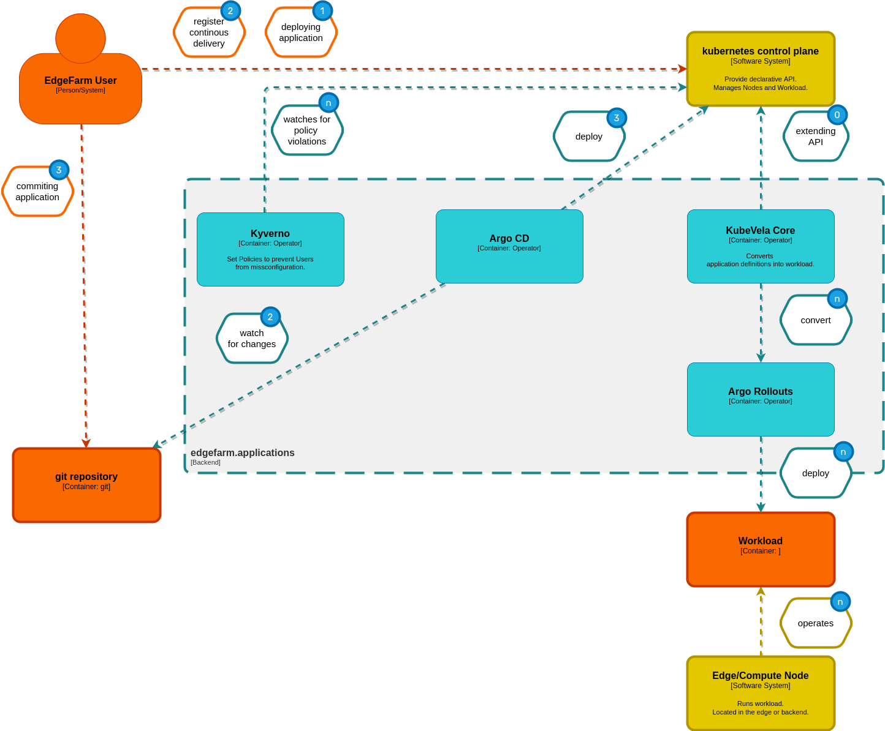

## **(0)** Initial state

KubeVela is configured and up and running and waits on application manifests.

## **(1)** Deploy an Application

User apply his application, defined by a manifest against the Kubernetes API.

KubeVela receives the manifest and converts the definition into argo rollouts ressources.
These ressources are pushed against the Kubernetes API and Kubernetes creates the workload on
the specific nodes.

## **(2)(3)** Deploy an Application through git (GitOps)

**(2)**

The user needs to tell Argo CD how to access his git repository.

From now on, Argo CD watches the repository for changes. If there any chages, Argo CD will pick up
the ressouces and push them against the Kubernetes API.

**(3)**

The user commits his application mainfest and Argo CD pushes the ressources.

The remaining processing is equal to 1.
