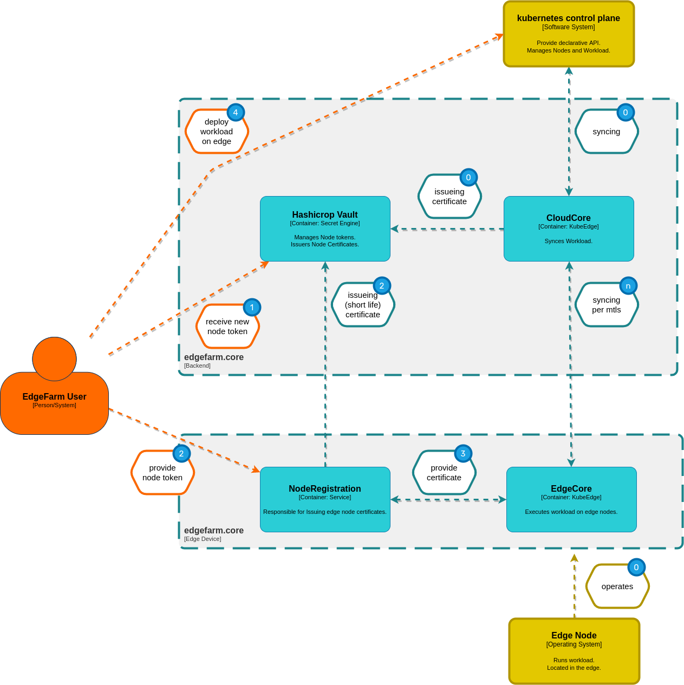

## **(0)** Initial state

Cloudcore is set up, valid certificates are stored, and is waiting for edge nodes.

## **(1)(2)(3)** Register a new device

**(1)**

The user issues a new node token from vault. This token is only valid for a specific device.

**(2)**

The user transfers the token to the NodeRegistration service of the device, after which the service has a certificate issued by vault and renews it cyclically. The certificates have a very short validity.

**(3)**

The certificate is transferred to the egdecore. The edgecore connects to the certificate at the Cloudcore and synchronizes from there on via mtls.

## **(4)** Deploy workload on edge

After going through the previous steps, it is now possible to deploy workloads to edge devices using standard Kubernetes tools.
