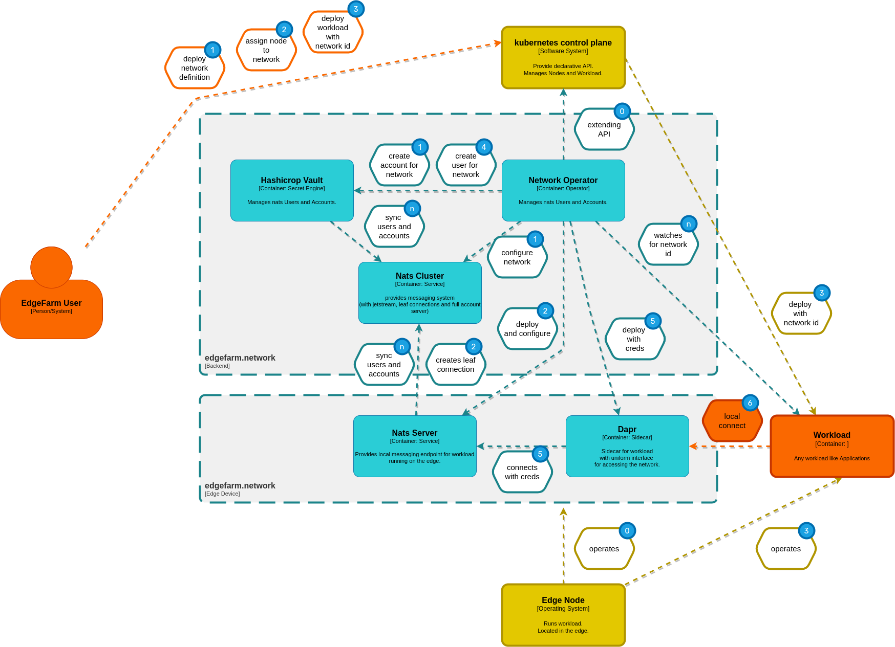

## **(0)** Initial state

Network Operator is up and running and waits on Network Ressources and pods with assigned networks.
Also Nats and Vault backend services are up and running and Vault continous sync credentials with Nats.

## **(1)** Create a Network

User creates and apply a network definition with network name, capacities and buffers.
Network Operator receive the network definition, creates an account for the network and setup
all defined buffers etc.

## **(2)** Assign node to network

User extend his manifest with a node selector matching his node.
Network Operator receive the updated network definition and deploys and configure a Nats Leaf Server to the node.

The leaf nats server connects to the backend nats server, all accounts getting synced, and the leaf server is ready to handle data.

## **(3)(4)(5)** Create workload with assigned network

**(3)**

User creates and apply a pod and assignes the network id.
Kubernetes creates the pod, the network operator gets informed.

**(4)**

The network operator creates a user in the network account.

**(5)**

The network controller patches the pod and add a dapr sidecar with user credentials.
The dapr sitecar connects to the local leaf nats server.

### **(6)** ready-to-use

From know on, the pod can use the dapr interface to tranfer his data.
