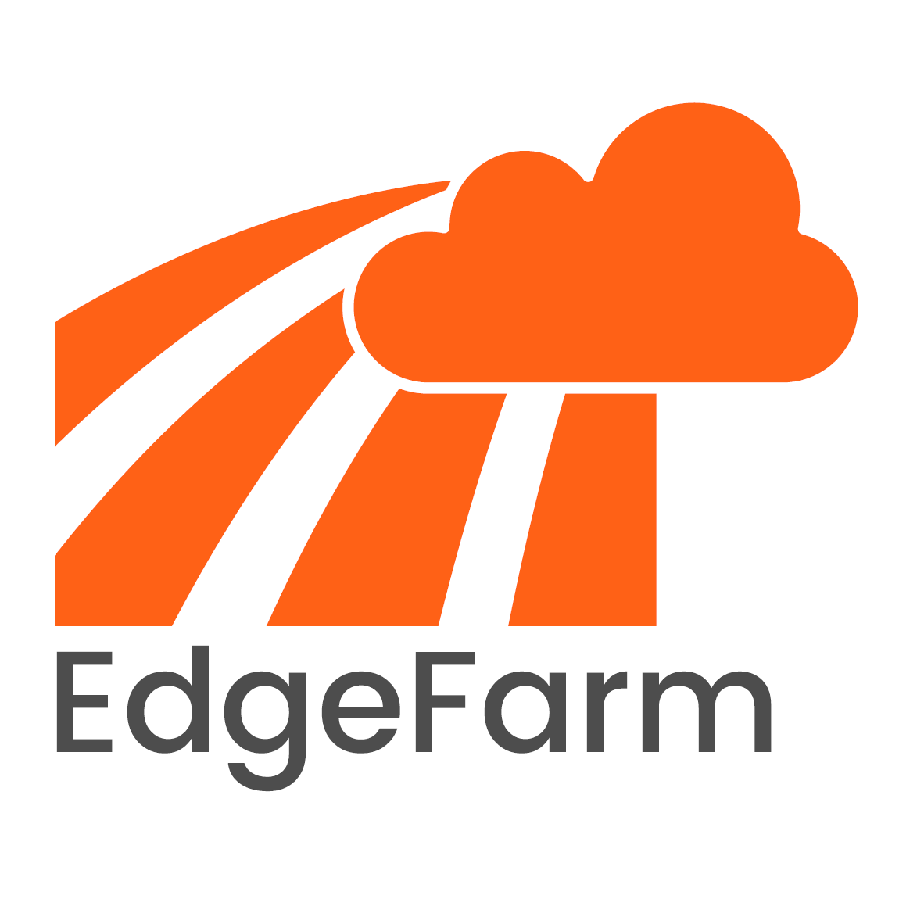

!!! info "EdgeFarm is currently under heavy construction"

    EdgeFarm is currently under active development and the corresponding components are being released gradually.

    Accordingly, the documentation is not yet complete. The functionalities described in the documentation refer to the final state after the release of all functions.

## What is EdgeFarm

***Seamless edge computing***

EdgeFarm is an open source cloud native development platform for edge- and hybrid applications where application assets can be freely moved between edge and cloud. Hybrid applications refer to applications that are partially deployed on edge devices and partially in the cloud.

Edgefarm is heavily based on Kubernetes. EdgeFarm extends Kubernetes with a bunch of great open source projects. EdgeFarm combines and extends these selectively to provide a platform that is hardly inferior to the comfort of native cloud development.

EdgeFarm extends Kubernetes to provide the following functions:

* dynamic and secure registration of edge nodes (edgefarm.core)
* life cycle management of edge node firmware (edgefarm.devices)
* life cycle management of edge- or hybrid applications (edgefarm.applications)
* reliable communication with data retention in the event of network loss and providing secure access of  third party systems (edgefarm.network)
* monitoring the whole stack (edgefarm.monitor)

... all done in a cloud native way.

## Why EdgeFarm?

How great would it be if you could write edge software just like cloud software for your Kubernetes based cloud backend? You'd be free to try out a new piece of software nearly effortless, you'd have access to a huge pool of open source software, you could use your existing CD/CD system to roll out your edge software, and so on.

But edge computing differs from cloud computing in one fundamental way. While compute power in the cloud can be scaled automatically at any time, edge devices are tied to specific locations and replacements or upgrades must be done manually on site. This means that network failures or outages cannot simply be bridged by redundancies and taken over by other compute resources.

This results in the requirement that egde devices must be able to run autonomously over a longer period of time and that the acquired data must be buffered until the connection is restored.

All software used on the edge devices must be able to handle unreliable network connections and synchronize with the backend system when the connection is restored.

If this was solved and my Edge device behaved like another Kubernetes node handling unreliable connections, it would make my day-to-day life as a programmer much more pleasant.

And that is why EdgeFarm is being developed.
