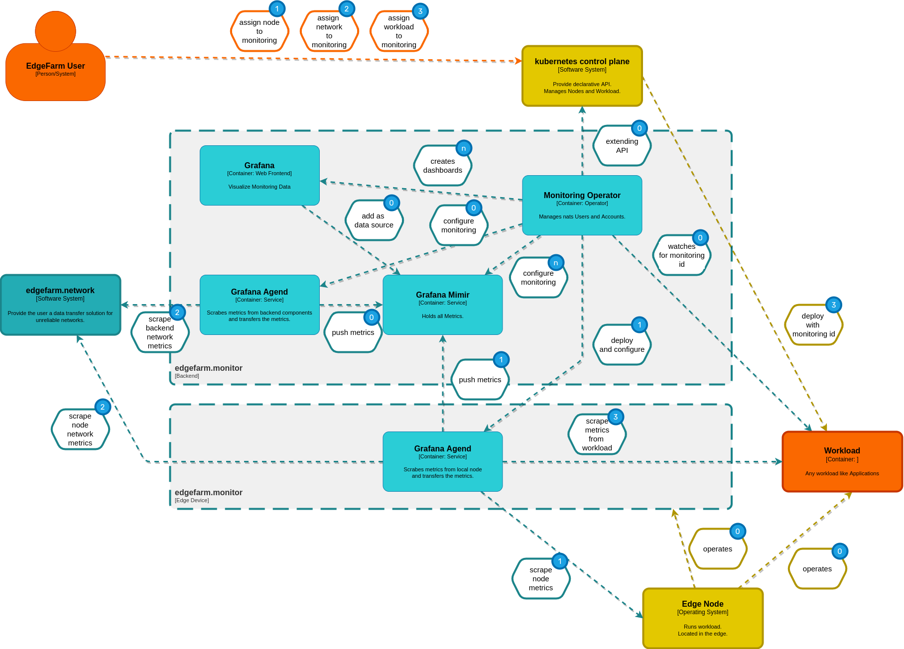

## **(0)** Initial state

Monitoring Operator is up an running, waiting on network ressources and watches for
workload and nodes with assigned monitoring id.

Grafana Mimir is up an running waiting for metrics to store.

Grafana Agent is up and running and watches for backend ressouces to monitor.

Grafana Web Frontend is up and running. Dashboards for node metrics, networks, applications are preconfigured and a data source to access data from Grafana Mimir is added.

## **(1)** Assign node to monitoring system

The User assigns a node to the monitoring system by setting a tag.
The Monitoring Operator gets informed about this tag and deploys and setup Grafana Agent on the node.

Grafana agent starts immediately to scrape node metrics, which will be contiously transfered to Grafana mimir, using `remote_write`. Grafana Mimir stores metrics. Grafana Web Frontend receives metrics and visualize them in the Dashboard.

## **(2)** Assign network to monitoring system

User assignes a previously created network to the monitoring system.

Grafana Agents, both edge and backend, start scraping network informations from the nats servers, provided by edgefarm.network.

## **(3)** Assign workload to monitoring system

User deploys workload with monitoring enabled.
The Monitoring Operator gets informed.
Grafana Agents on all workload nodes start scraping metrics from this workload.
