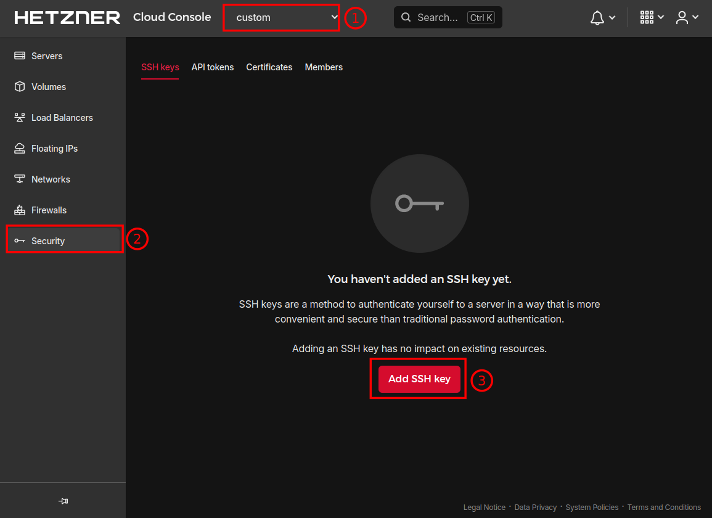
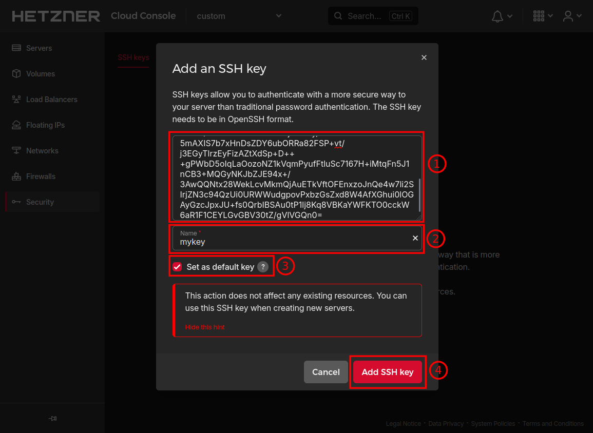
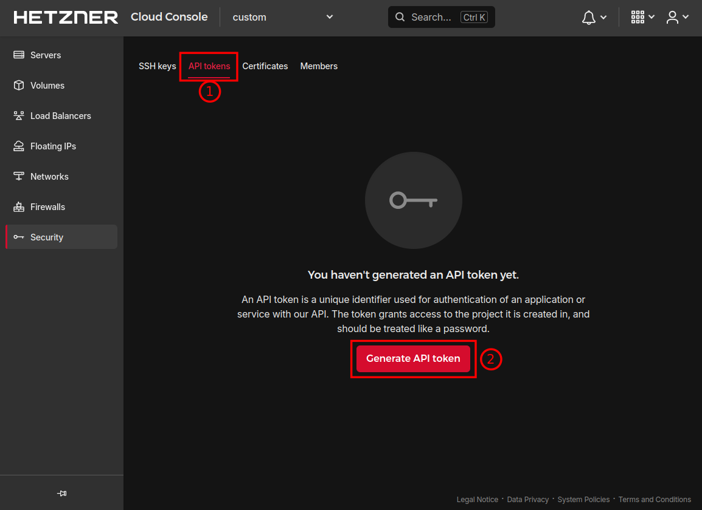
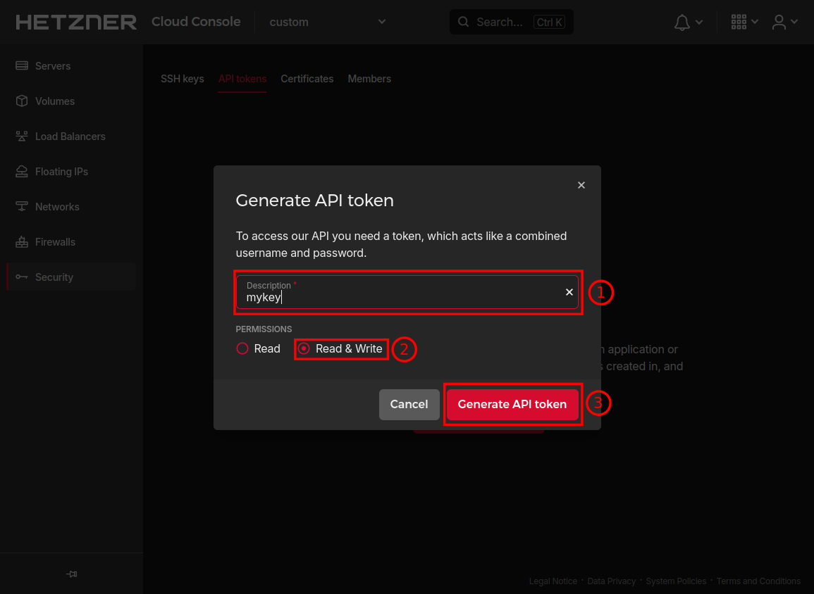
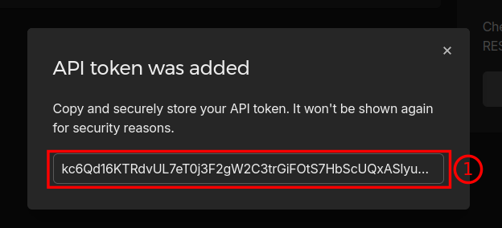
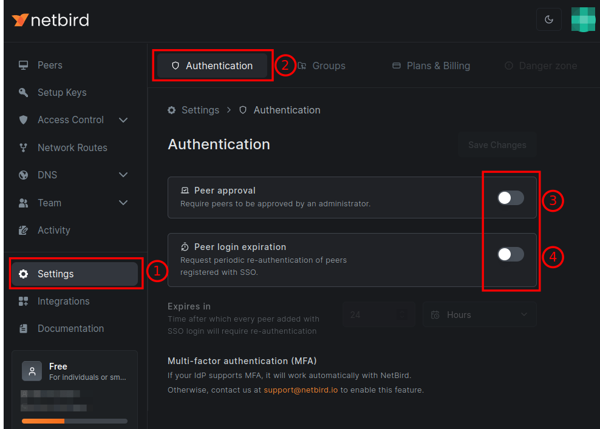

# Create a EdgeFarm cluster that runs on Hetzner Cloud

This tutorial will guide you through the process of creating a EdgeFarm cluster that runs on Hetzner Cloud. This is a good choice if you want to run a EdgeFarm cluster in a more production like environment.
You can then follow the [Getting Started](../getting-started.md) guide to deploy your first application.

## Prerequisites

### Install kubectl

=== "Linux"

    [How to install Docker on Linux](https://docs.docker.com/desktop/install/linux-install/)

    Choose the right version of kubectl for your architecture:

    === "amd64"

        [kubectl v1.22.17](https://dl.k8s.io/v1.22.17/bin/linux/amd64/kubectl) - click to download
    === "arm64" 

        [kubectl v1.22.17](https://dl.k8s.io/v1.22.17/bin/linux/arm64/kubectl) - click to download

=== "MacOS"
    
    [How to install Docker on macOS](https://docs.docker.com/desktop/install/mac-install/)
    
    Choose the right version of kubectl for your architecture:

    === "amd64"

        [kubectl v1.22.17](https://dl.k8s.io/v1.22.17/bin/darwin/amd64/kubectl) - click to download
    === "arm64" 

        [kubectl v1.22.17](https://dl.k8s.io/v1.22.17/bin/darwin/arm64/kubectl) - click to download

=== "Windows running WSL2"

    [How to install Docker in Windows](https://docs.docker.com/desktop/install/windows-install/) and [WSL2 backend](https://docs.docker.com/desktop/wsl/)

    [kubectl v1.22.17](https://dl.k8s.io/v1.22.17/bin/linux/amd64/kubectl) - click to download

### Prepare Hetzner Cloud

Prepare your Hetzner Cloud account by creating a SSH-Key and a API Token. You can do this in the Hetzner Cloud Console. Visit [https://console.hetzner.cloud/](https://console.hetzner.cloud/) and login with your credentials.

#### Create a SSH-Key for your Hetzner project

You need to create a SSH-Key for your Hetzner project. Navigate to your project and then to security. Here you are able to create a new SSH-Key.
Enter your public Key, give it a name and enable the `Set as default key` option. Keep the SSH key name for later.

{: style="width:150px"}
{: style="width:150px"}

*Click the images to see the full size.*

#### Create a Hetzner API Token

You need to create a read/write API token in your Hetzner project. Keep the API token for later.

{: style="width:150px"}
{: style="width:150px"}
{: style="width:150px"}

### Prepare netbird.io

You need an account at [netbird.io](https://netbird.io). This step is mandatory and cannot be skipped. Create a free account and create a personal access token. Keep the access token for later.  Follow the [netbird docs](https://docs.netbird.io/how-to/access-netbird-public-api#creating-an-access-token).

Keep the created access token for later. 

Also, you need to ensure some authentication settings. Disable both `Peer approval` and `Peer login expiration` in the `Settings` section of Netbird.io

{: style="width:150px"}

## Create the hetzner cluster

In order to create the cluster on Hetzner Cloud, you need to have a local bootstrap cluster running. This is a (temporary) cluster to create and maintain the Hetzner Cloud cluster. The bootstrap cluster is created automatically by the `local-up` tool and keeps the Hetzner Cluster alive if something goes terribly wrong with any nodes. 

Download the `local-up` tool from the [EdgeFarm releases page](https://github.com/edgefarm/edgefarm/releases) or run this command:

```console
curl -sfL https://raw.githubusercontent.com/edgefarm/edgefarm/main/install.sh | sh -s -- -b ~/bin && chmod +x ~/bin/local-up
```


Once you've got everything set up, go ahead and run the local-up tool to **generate a configuration file** for a Hetzner Cloud type cluster. 

```console
local-up cluster create --generate-config --type hetzner > ~/my-hetzner-cluster.yaml
```

You are faced with a configuration file tempalte. When filled out it might looks like this

```yaml
kind: Cluster
apiVersion: config.edgefarm.io/v1alpha1
metadata:
  name: edgefarm #(1)!
spec:
  type: hetzner #(2)!
  general:  #(3)!
    kubeConfigPath: ~/.edgefarm-local-up/edgefarm-bootstrap  
    statePath: ~/.edgefarm-local-up/edgefarm.json
  hetzner:
    controlPlane: #(4)!
      count: 3  
      machineType: cx21 
    workers: #(5)!
      count: 2
      machineType: cx31
    hetznerCloudRegion: nbg1 #(6)!
    hetznerCloudSSHKeyName: mykey #(7)!
    hcloudToken: kc6Qd16KTRdvUL7eT0j3F2gW2C3trGiFOtS7HbScUQxASly################# #(8)!
    kubeConfigPath: ~/.edgefarm-local-up/hetzner #(9)!
  netbird:
    setupKey: <your netbird.io setup key> #(10)!
```

1. You might want to change the name of the cluster
2. The type of the cluster is `hetzner`. This is important, as the local-up tool will use this to determine which cloud provider to use.
3. The `spec.general` section contains the paths of the kubeconfig for the bootstrap cluster and the path to a state file. Change paths if you like.
4. Within `spec.hetzner.controlPlane` define the number of control plane nodes and the machine type. See [https://docs.hetzner.com/cloud/servers/overview#shared-vcpu](https://docs.hetzner.com/cloud/servers/overview#shared-vcpu) for available machine types.
5. Within `spec.hetzner.workers` define the number of worker nodes and the machine type. See [https://docs.hetzner.com/cloud/servers/overview#shared-vcpu](https://docs.hetzner.com/cloud/servers/overview#shared-vcpu) for available machine types.
6. The Hetzner Cloud region to use. See [https://docs.hetzner.com/cloud/general/locations#what-locations-are-there](https://docs.hetzner.com/cloud/general/locations#what-locations-are-there) for available regions/locations.
7. Enter the name of the SSH key you previously created or any other you want to use to access the nodes. You can create a new SSH key in the Hetzner Cloud Console.
8. Enter the name of the Hetzner Cloud API token you previously created.
9. The path to the kubeconfig file for the Hetzner Cloud cluster. Change if you like.
10. Leave the setupKey for now. It will be configured later.

The next step is to **preconfigure netbird.io**. For this step you need the netbird API token created earlier. 

```console
local-up vpn preconfigure --netbird-token <your-access-token> --config ~/my-hetzner-cluster.yaml
```

This will configure netbird.io with the given access token and create a setup key. The setup key is then added to the configuration file automatically.

Now you can **create the Hetzner Cloud cluster** with the following command:

```console
local-up cluster create --config ~/my-hetzner-cluster.yaml
```

??? "kubeconfig path notes"

    The location for the kubeconfig file is configured in your cluste config file in `.spec.hetzner.kubeConfigPath`. This means, you have to set the `KUBECONFIG` environment variable to access the cluster with `kubectl`:

    In the example the path was set to `~/.edgefarm-local-up/hetzner`. You can set the `KUBECONFIG` environment variable like this:

    ```console
    export KUBECONFIG=~/.edgefarm-local-up/hetzner
    ```

    or use the `--kubeconfig` flag with `kubectl`:

    ```console
    kubectl --kubeconfig ~/.edgefarm-local-up/hetzner get nodes
    ```

    or the even better choice: **use a tool to manage multiple kube contexts for you, e.g. [kubecm](https://github.com/sunny0826/kubecm) or  [kubie](https://github.com/sbstp/kubie)**
    

If everything went well, you should see something like this:

```{: .console .no-copy}
The hetzner cluster has been created.
Run $ local-up deploy --config <hetzner-config.yaml> to deploy EdgeFarm components and its dependencies.
Have a look at the arguments using '--help'.
```

## Deploy EdgeFarm components

Now you can **deploy the EdgeFarm components** to the Hetzner Cloud cluster. 

```console
$ local-up deploy --config ~/my-hetzner-cluster.yaml
```

This will deploy the EdgeFarm components and its dependencies to the Hetzner Cloud cluster. This might take a few minutes.

If everything went well, you should see something like this:

```{: .console .no-copy}
The EdgeFarm cluster is ready to use! Have fun exploring EdgeFarm.
To access the cluster use 'kubectl', e.g.
 $ kubectl get nodes
```

!!! note "deploy notes"

    See `deploy` options using the `--help` flag to skip certain components or to deploy a specific component only.

## Deleting the cluster

If you want to delete the cluster, you can do this with the following command:

```console
local-up cluster delete --config ~/my-hetzner-cluster.yaml
```

This deletes the Hetzner Cloud cluster followed by the bootstrap cluster.
Log into https://console.hetzner.cloud/ and verify that all servers and load balancers are deleted. Go to volumes and delete the volumes manually if needed.

# Considerations

## Costs

Running a Hetzner Cloud cluster will incur costs. The costs depend on the number of nodes, the machine types and the region you choose. You can find the pricing information on the [Hetzner Cloud pricing page](https://www.hetzner.com/cloud/pricing). To create a HA cluster, you need at least 3 control plane nodes (minimum cx21). For the worker nodes, you can start with 2 nodes (minimum cx31). As of time of writing, the costs for a cluster with 3 control plane nodes and 2 worker nodes in the nbg1 region are around 50€ per month.

## Management

It's totaly up to you how to create and manage your kubeadm cluster that runs EdgeFarm. If you use `local-up` to create the cluster, you get the local running bootstrap cluster. As long as you don't delete the bootstrap cluster, the Hetzner Cloud cluster will be kept alive. If you delete the bootstrap cluster only e.g. by deleting the local container, be aware that the Hetzner Cloud cluster will be still alive. However, it isn't managed anymore. This means if anything goes haywire with any node, it won't be fixed automatically. You have to take care of it manually. Always be aware of the costs you have to pay for the Hetzner Cloud cluster.
