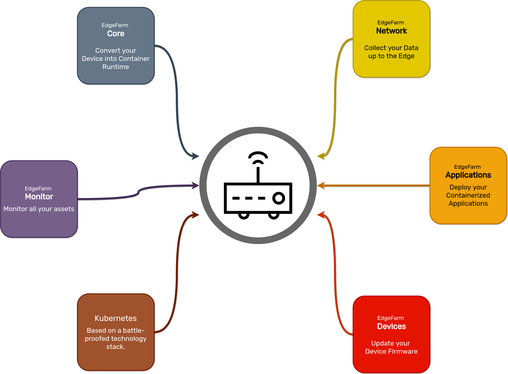

# EdgeFarm Components

EdgeFarm consists of several independently deployable components, each extending the EdgeFarm system with specific functionalities.

## Kubernetes

Kubernetes is not an edgefarm component, but the foundation for all components.

Kubernetes already brings many useful features that edgefarm relies on and are used within edgefarm.

Functions such as declarative setup, secure authorization, application lifecycle management, storage management, redudancy, etc. are available out of the box and only need to be adapted by EdgeFarm.

## edgefarm.core

edgefarm.core extends the Kubernetes cluster with the ability to add edge nodes. This makes it possible to roll out Kubernetes workload to edge devices, the foundation for all other components.

In particular, the following functions are available to the user:

* secure token-based node authentication
* node revocation
* scheduling of any workload on edge nodes
* retrieve status information from workload

edgefarm.core is made possible by the great open source projects [KubeEdge](https://kubeedge.io/en/) and [HashiCorp Vault](https://www.hashicorp.com/products/vault).

## edgefarm.devices

Kubernetes itself can manage and update workload on corresponding nodes. The operating system of the node itself must be updated in another way.

edgefarm.device extends the Kubernetes cluster with the functionality to update the operating system of the edge nodes, e.g. to update the Linux kernel or to install driver modules.

In particular, the following functions are available to the user:

* Image signing
* A/B updates with rollback
* scheduled rollouts
* phased rollouts
* GitOps ready

## edgefarm.applications

Kubernetes takes an infrastructure-centric approach to defining workload. Workload is defined by deployments, statefullsets, pods, ingresses, etc., which is very powerful. However, this approach is also tied to a very steep learning curve.

edgefarm.applications encapsulates this approach with the help of [KubeVela](https://kubevela.io) and follows an application-oriented approach.

edgefarm.applications is complemented by other great open source projects to implement a fully comprehensive application livecycle management.

In particular, the following functions are available to the user:

* Application-centric approach
* Application rollout with rollback
* sheduled rollouts
* phased rollouts
* GitOps ready

## edgefarm.network

Dealing with unreliable networks is not easy and has been solved many times, but at the application level.

With edgefarm.network a solution is available that encapsulates the problem and relieves the application developer. The application developer is offered an API that can be utilized to send the data. edgefarm.network then takes care that the data is transferred reliably.

edgefarm.network uses the open source project [nats](https://docs.nats.io) under the hood for this, a swiss army knife for messaging.

In particular, the following functions are available to the user:

* Isolated messaging networks
* User defined buffer sizes and data retention
* [Dapr](https://docs.dapr.io)-based convenience layer for easy access
* Secure access from third-party systems

## edgefarm.monitor

At the latest when the devices are installed and the applications are distributed, the user wants to know how the system is doing.

edgefarm.monitor provides an out-of-the-box solution that can monitor all assets of the system, including applications and inform the user about error conditions.

edgefarm.monitor is based on the great open source [Grafana](https://grafana.com) stack. 

In particular, the following functions are available to the user:

* Monitoring of node health
* Monitoring of application health
* Monitoring of network capacity
* Preconfigured Grafana Dashboard
* Get Alerts on errors
