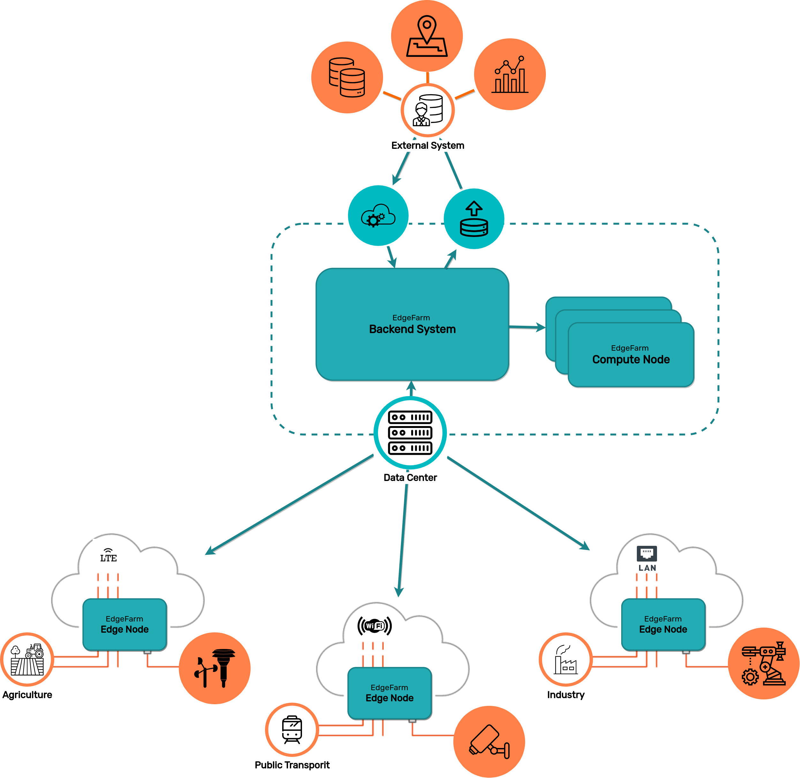

# System Overview and Clarification

A typical EdgeFarm setup consists of the following parts.

## Backend System

The backend system takes care of all management functions within EdgeFarm. It accepts configurations and takes care of creating the desired state.

The backend system, like all other software parts, are managed by Kubernetes. Accordingly, backend functions are accessed via the [Kubernetes API](https://kubernetes.io/docs/concepts/overview/kubernetes-api/). Depending on which EdgeFarm functionalities are installed, the API is extended with corresponding [controllers](https://kubernetes.io/docs/concepts/architecture/controller/) and [custom resources](https://kubernetes.io/docs/concepts/extend-kubernetes/api-extension/custom-resources/) (CR).

These CR's are then available to EdgeFarm users to implement their functionality.

The exact details of the backend functionalities provided are covered in the corresponding components documentation.

## Nodes

From [Kubernetes Docs](https://kubernetes.io/docs/concepts/architecture/nodes/):

"Kubernetes runs your workload by placing containers into Pods to run on Nodes. A node may be a virtual or physical machine, depending on the cluster."

Nodes are the place/the machine/the compute where the applications run. In the case of EdgeFarm, Kubernetes is extended to also support edge devices as Kubernetes nodes on which workloads can be deployed, just like classic nodes.

A typical Kubernetes cluster consists of multiple nodes. Any workload can run on these nodes, such as the backend system or the users applications.

### Edge Node

Edge nodes are special nodes, typically running on embedded hardware (but also server hardware) that access or provide information to local resources.

Due to their localization, edge nodes have various constraints such as unreliable connections, bandwidth limitations, or compute power limitations that must be dealt with.

EdgeFarm extends these nodes with software components that can handle these limitations. These components can be used by the end-user application.

### Compute Node

A typical Kubernetes cluster consists of multiple nodes. Any workload can run on these nodes, such as the backend system or the developed applications.

When developing hybrid edge/cloud applications, it is often necessary to outsource certain parts of the application to the cloud, e.g. because certain information needs to be aggregated from different edge devices or because there is not enough computing power available in the edge.

Using EdgeFarm, certain cloud nodes can be marked as "compute nodes" on which the corresponding application parts can then be rolled out.
