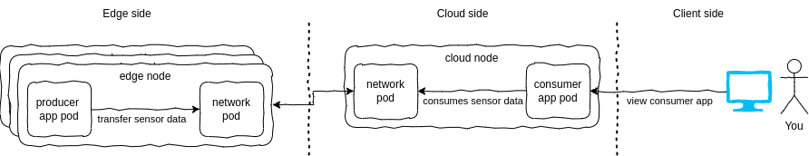

Example: basic
==============

# The components

This example shows how a `hybrid-application` could be defined and deployed.
The term `hybrid-application` means that parts of an application is deployed to cloud nodes and parts of it is deployed on edge nodes. All parts, wherever they are deployed, form the overall application.

This example consists of two parts: 
* A `producer` that run on edge nodes. It is a simple golang application and produces simulated sensor data.
* A `consumer` that run on cloud nodes and consume the sensor data. The consumer is a basic web application that can be viewed in a browser.

Both parts are connected to the `EdgeFarm.network`. The consumer drops the generated data in a stream that is buffered locally. Note, that the producer can run on many edge nodes, each collecting data individually. When the device is online, the consuming part of the network aggregates the data from all edge nodes and puts them into another stream running in the cloud. The consumer part of the network consumes this stream and displays the data in a browser.

The following picture shows the overall architecture of the example:



# The development

The source code of both `consumer` and `producer` are located within this directory. Have a look if you are interesested in the details.
Both components are published as OCI images to ghcr.io. 
The `consumer` is published as `ghcr.io/edgefarm/edgefarm/example-basic-consumer:latest` and 
the `producer` is published as `ghcr.io/edgefarm/edgefarm/example-basic-producer:latest` as multi-arch images for amd64 and arm64.

# The deployment

Both application components need to be deployed to the cluster. 

## Producer explained

The manifest files are located in `./producer/deploy`

The producer is deployed to the edge nodes. The following snippet shows the deployment manifest:

```yaml
apiVersion: core.oam.dev/v1beta1
kind: Application
metadata:
  name: example-producer
spec:
  components:
    - name: producer
      type: edgefarm-applications
      properties:
        image: ghcr.io/edgefarm/edgefarm/example-basic-producer:latest
        nodepoolSelector:
          matchLabels:
            example: "producer"
        name: producer
        cpu: 0.25
        memory: 256Mi
      traits:
        - type: edgefarm-network
          properties:
            network:
              name: example-network
              subnetwork: edge-to-cloud
              user: publish
```

The application contains one component called `producer` that runs our OCI image mentioned before. The component is deployed to all nodes, that the corresponding nodepool has the label `example=producer`. There are also some limits defined how much CPU resources and memory the container is allowed to consume. If the application shall be enabled to communicate with a network, a trait of type `edgefarm-network` must be added. In this case, the component is connected to the network `example-network` and the user `publish` is allowed to publish data to the network. We can define multiple sub-networks in the network definition. In this case, the component is connected to the sub-network `edge-to-cloud`.

A network resource needs to be defined as well, otherwise the application would not be able to start. The following snippet shows the network definition:

```yaml
apiVersion: streams.network.edgefarm.io/v1alpha1
kind: Network
metadata:
  name: example-network
spec:
  compositeDeletePolicy: Foreground
  parameters:
    users:
      - name: publish
        limits:
          payload: -1
          data: -1
          subscriptions: -1
        permissions:
          pub:
            allow:
              - "*.sensor"
              - "$JS.API.CONSUMER.>"
              - "$JS.ACK.>"
          sub:
            allow:
              - "*.sensor"
    subNetworks:
      - name: edge-to-cloud
        limits:
          fileStorage: 1G
          inMemoryStorage: 100M
        nodepoolSelector:
          matchLabels:
            example: "producer"

    streams:
      - name: sensor-stream
        type: Standard
        subNetworkRef: edge-to-cloud
        config:
          subjects:
            - "sensor"
          discard: Old
          retention: Limits
          storage: File
          maxConsumers: -1
          maxMsgSize: -1
          maxMsgs: -1
          maxMsgsPerSubject: -1
          maxBytes: 10000000

      - name: aggregate-stream
        type: Aggregate
        config:
          discard: Old
          retention: Limits
          storage: File
          maxConsumers: -1
          maxMsgSize: -1
          maxMsgs: -1
          maxMsgsPerSubject: -1
          maxBytes: 500000000
        references:
          - sensor-stream
```

The network section is split up into several sub-sections in the spec. 
There are `users` that are allowed to publish or subscribe to specific subjects.
There are `subNetworks` that specifies which parts of the network shall run on which nodes. In this case, the sub-network `edge-to-cloud` is deployed to all nodes that have the label `example=producer` and have some file-storage and memory limits set. 
There are `streams` that basically act as buckets. Each bucket has a configurable size. It is configured how long data is kept in the bucket and how much data can be stored in the bucket. It can be defined what to do if the bucket is full. It can drop old messages or block incoming messages. The streams can be defined where to run. They can be either be located in the cloud (no subNetworkRef) or on a edge node (subNetworkRef is set). 

In this example there are two stream definitions that basically act like this:
`sensor-stream`: Create a bucket with the given size and characteristics on each edge node that matches the subNetworks selector. Each edge node gets its own, unique instance of the stream located on the device. The bucket is named `sensor-stream`. The bucket is configured to accept messages with the subject `sensor`. The size is 10000000 bytes. If the bucket is full, drop old messages.

`aggregate-stream`: Create a bucket with the given size and characteristics in the cloud. The bucket is named `aggregate-stream`. The size is 500000000 bytes. If the bucket is full, drop old messages. The bucket is referenced to the `sensor-stream` meaning that it aggregates all data from all sensor stream instances.

There is also a user called `publish` that is allowed to publish n specific subjects - also "*.sensor". The `*` acts as a wildcard. This is needed, because the producer prefixes it's messages with its unique name. 

The suNetwork `cloud-to-edge` defines that each matching edge node is equipped with a component that is part of that specific EdgeFarm.network. In the end, there is a pod running on each edge node that connects to the network. 

## Consumer explained

The manifest files are located in `./consumer/deploy`

The consumer is deployed to the cloud nodes. The following snippet shows a standard Kubernetes deployment manifest:

```yaml
apiVersion: apps/v1
kind: Deployment
metadata:
  labels:
    app.kubernetes.io/instance: example-consumer
  name: example-consumer
spec:
  replicas: 1
  selector:
    matchLabels:
      app.kubernetes.io/instance: example-consumer
  strategy:
    rollingUpdate:
      maxSurge: 25%
      maxUnavailable: 25%
    type: RollingUpdate
  template:
    metadata:
      labels:
        app.kubernetes.io/instance: example-consumer
    spec:
      containers:
        - env:
            - name: NATS_SERVER
              value: nats://nats.nats.svc:4222
            - name: NATS_EXPORT_SUBJECT
              value: "*.sensor"
            - name: NATS_STREAM_NAME
              value: aggregate-stream
            - name: NATS_CREDS
              value: /creds/network.creds
          image: ghcr.io/edgefarm/edgefarm/example-basic-consumer:latest
          imagePullPolicy: IfNotPresent
          name: consumer
          resources:
            limits:
              cpu: 500m
              memory: 256Mi
            requests:
              cpu: 250m
              memory: 128Mi
          volumeMounts:
            - mountPath: /creds/network.creds
              name: creds
              readOnly: true
              subPath: creds
      restartPolicy: Always
      volumes:
        - name: creds
          secret:
            defaultMode: 420
            secretName: example-network-publish
```

This defines a deployment manifest that runs our OCI images referenced earlier. It uses the network credentials as volumes to create the connection to the network. The consumer is configured to consume all messages with the subject `*.sensor` from the stream `aggregate-stream`.

To be able to access the `consumer` application we need a standard Kubernetes service resoure. 

```yaml
apiVersion: v1
kind: Service
metadata:
  name: example-consumer
spec:
  ports:
    - port: 5006
      targetPort: 5006
  selector:
    app.kubernetes.io/instance: example-consumer
```

This service exposes the port 5006 of the consumer application to the cluster.

# In Action

Deploy both, producer and consumer, to the cluster:

```console
$ kubectl apply -f ./producer/deploy
application.core.oam.dev/example-producer created
network.streams.network.edgefarm.io/example-network created
$ kubectl apply -f ./consumer/deploy
deployment.apps/example-consumer created
service/example-consumer created
```

Decide what edge nodes shall run the producer component:

```console
$ kubectl label nodepools.apps.openyurt.io edgefarm-worker3 example=producer
nodepool.apps.openyurt.io/edgefarm-worker3 labeled
```

Wait until everything is up and running:

```console
$ kubectl get pods     
NAME                                                              READY   STATUS    RESTARTS   AGE   IP            NODE               NOMINATED NODE   READINESS GATES
example-consumer-d69db86c8-n25vb                                  1/1     Running   0          10m   10.244.3.35   edgefarm-worker    <none>           <none>
example-network-default-edge-to-cloud-edgefarm-worker3-5fqfsxl5   1/1     Running   0          12m   10.244.1.5    edgefarm-worker3   <none>           <none>
producer-edgefarm-worker3-s9pbw-5d6f874f65-qfqmf                  2/2     Running   0          16m   10.244.1.6    edgefarm-worker3   <none>           <none>
```

Check the streams that are created and watch the messages flowing in:

```console
$ kubectl get streams.nats.crossplane.io -o wide                       
NAME                          EXTERNAL-NAME      READY   SYNCED   DOMAIN                                                   AGE   ADDRESS                     ACCOUNT PUB KEY                                            MESSAGES   BYTES    CONSUMERS
example-network-25gn7-6bhcs   aggregate-stream   True    True     main                                                     10m   nats://nats.nats.svc:4222   ACDB55OTMWZM6LP4R3I3E5WRLJWWVHCWEBLN5ECYOQCN3BTH5NPDMLD4   321        2.0 MB   1
example-network-25gn7-qxc2v   sensor-stream      True    True     example-network-default-edge-to-cloud-edgefarm-worker3   10m   nats://nats.nats.svc:4222   ACDB55OTMWZM6LP4R3I3E5WRLJWWVHCWEBLN5ECYOQCN3BTH5NPDMLD4   321        1.9 MB   0
```

Forward the service of the `consumer` to your local machine and open a browser at http://localhost:5006/serve.

```console
$ kubectl port-forward service/example-consumer 5006:5006
```
